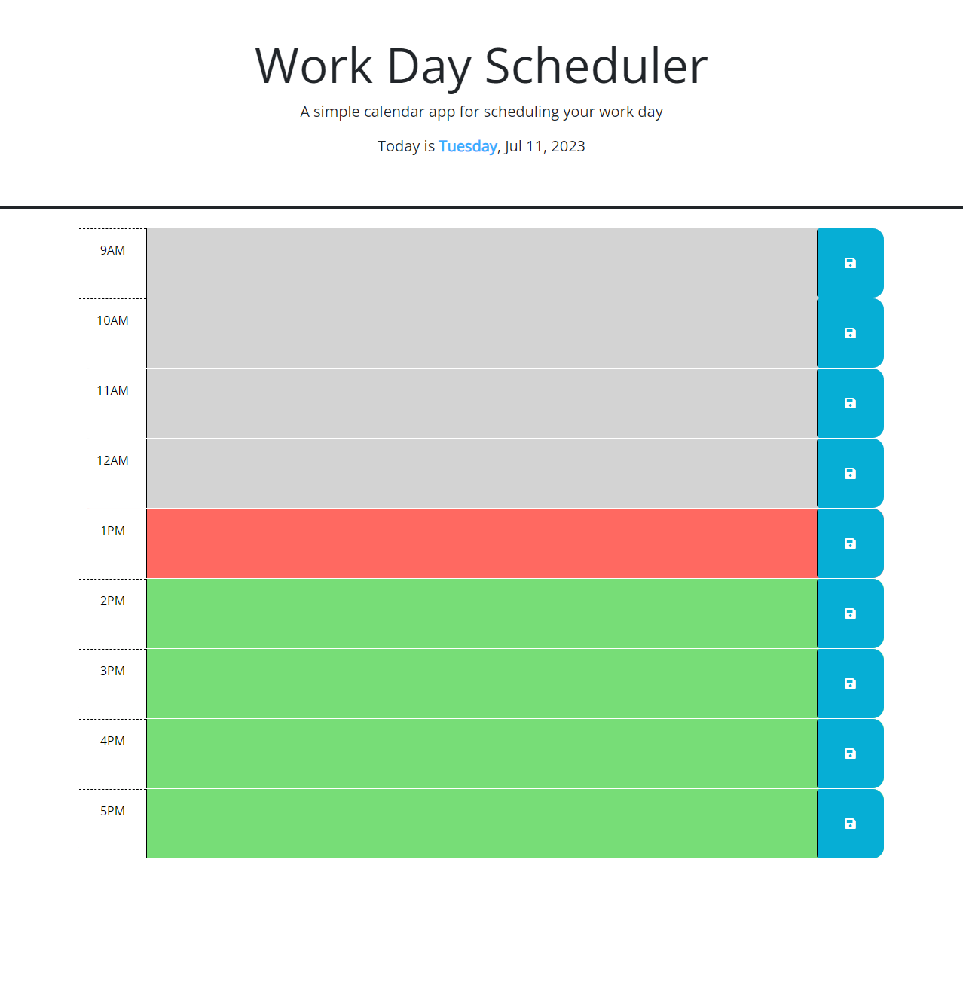

# Work Day Scheduler

A simple calendar app for scheduling your work day.

The Work Day Scheduler is a web-based application that allows users to plan and organize their work day. Users can create a schedule by entering events and saving them in the local storage of their browser. The application provides a user-friendly interface with color-coded time blocks to indicate past, present, and future events.

[Link to application](https://nickucla.github.io/Nicks-work-day-scheduler/)

## Features

- **Current Day Display**: The current day is prominently displayed at the top of the calendar when the application is opened.
- **Time Blocks for Standard Business Hours**: The scheduler presents time blocks for the standard business hours of 9 AM to 5 PM, allowing users to schedule events within this timeframe.
- **Color-Coded Time Blocks**: Each time block is color-coded to indicate whether it is in the past, present, or future. This visual representation helps users quickly identify the status of their scheduled events.
- **Event Creation and Saving**: Users can click into a time block, enter an event description, and save it using the save button. The entered event is then saved in the local storage of the browser.
- **Persistent Event Storage**: Saved events persist even when the page is refreshed or closed. The application retrieves the saved events from local storage upon page load, ensuring that the user's schedule remains intact.

## Usage

1. Open the Work Day Scheduler in your preferred web browser.
2. The current day will be displayed at the top of the calendar.
3. Scroll down to view the time blocks for the standard business hours.
4. Each time block is color-coded to indicate its status: gray for past events, red for the present hour, and green for future events.
5. Click into a time block to enter an event description.
6. Click the save button for the respective time block to save the event.
7. The saved events will persist even if you refresh the page or close the browser.

## Technologies Used

- HTML
- CSS (Bootstrap framework)
- JavaScript (jQuery library and Day.js)

## Credits

The Work Day Scheduler application was developed by Nick Heal with starter from UCLA extension.

## License

This project is licensed under the [MIT License](LICENSE).
